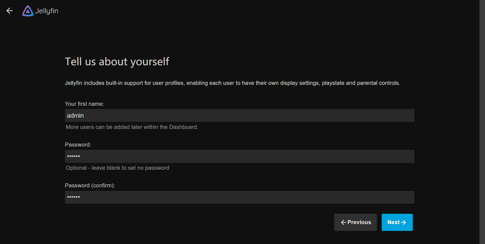
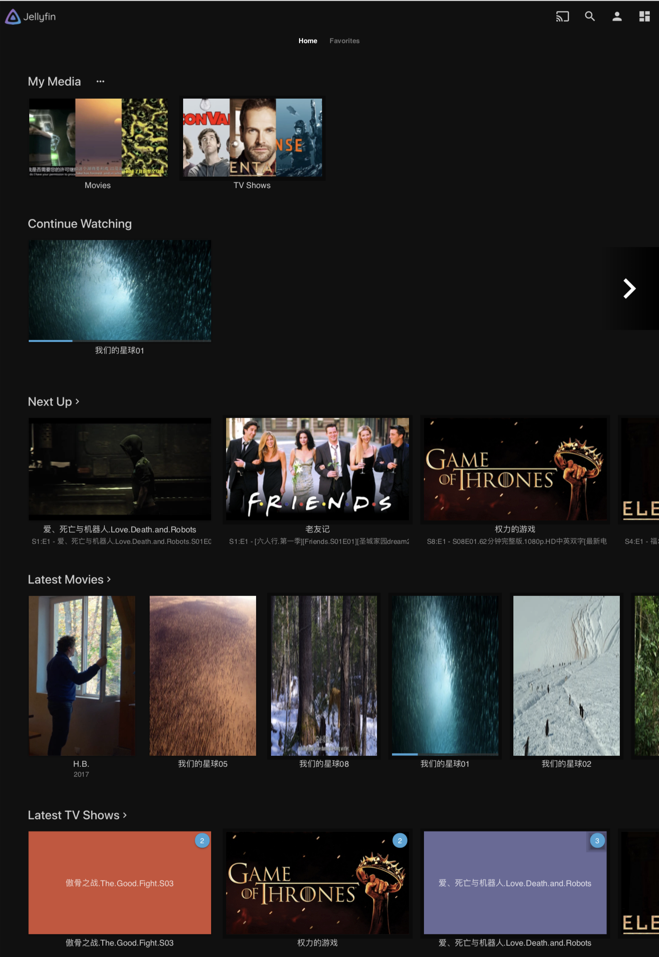
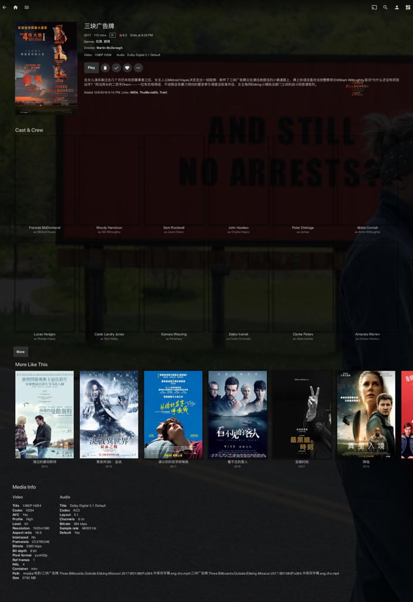
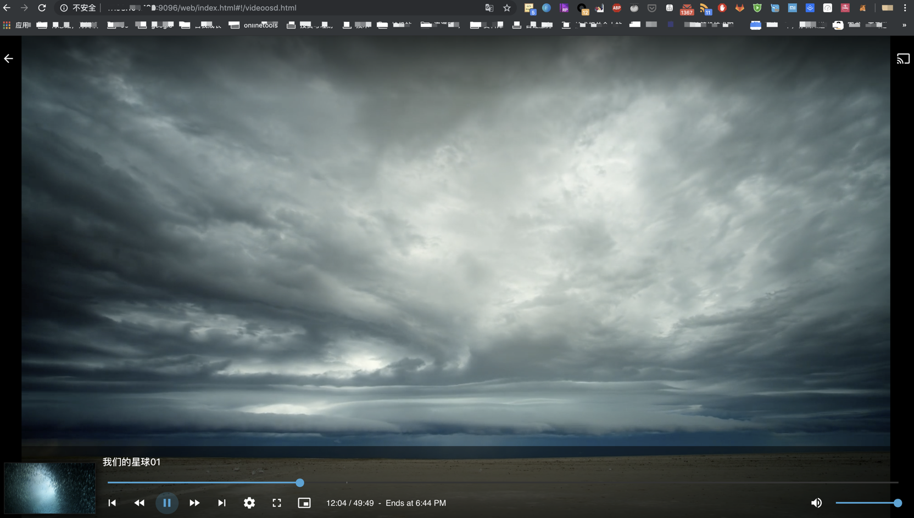

# jellyfin-docker

> docker 一键部署 jellyfin 在线媒体库

------

## 概要

一个非常 Cool 的媒体播放器，支持在线观看电影、音乐、图片、书籍、TV、MV 等多种格式，支持内网穿透，支持电视投屏！

当然它和 [mstream](https://github.com/lyy289065406/mstream-docker) 和 [calibre](https://github.com/lyy289065406/calibre-docker) 这类专精于音乐库或书库的软件相比，功能要简单得多，但胜在易用，可以满足大部分人的基本需求。

展开查看效果图

 

## 环境要求

  

## 部署步骤

### 1. 项目构建

- 宿主机安装 docker、docker-compose
- 宿主机安全组/防火墙（iptables/firewall）放行这些端口的入口流量： 8096
- 下载仓库： `git clone https://github.com/lyy289065406/jellyfin-docker /usr/local/jellyfin-docker`
- 打开仓库目录： `cd /usr/local/jellyfin-docker`
- 构建镜像并运行： `./run.sh`

### 2. 配置 jellyfin

- 打开 GUI [`http://${ip}:8096`](http://127.0.0.1:8096)，所有配置都在页面完成
- 手动上传个人媒体到 [`jellyfin/media`](./jellyfin/media) 下的子目录即可使用

